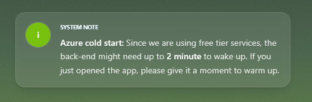
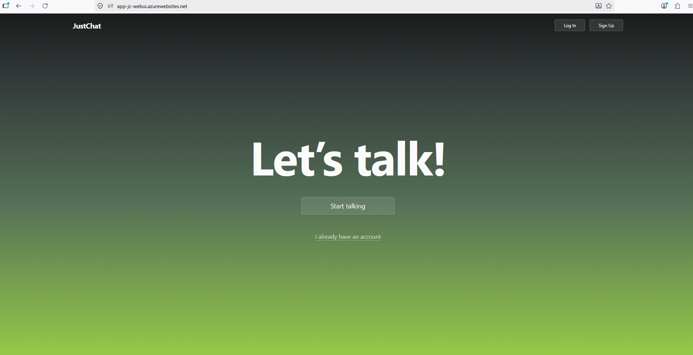
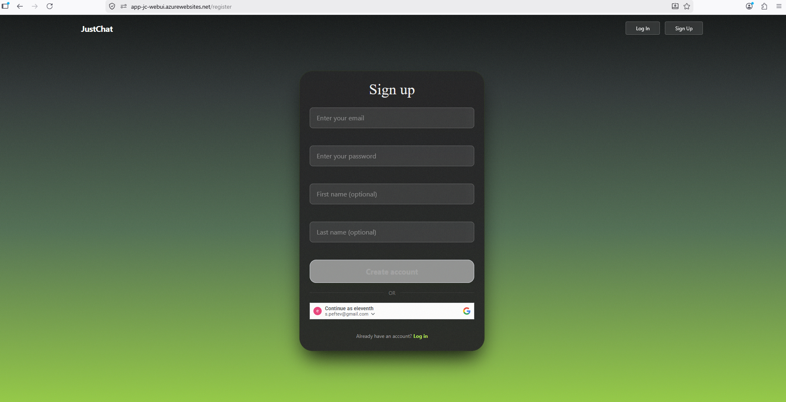
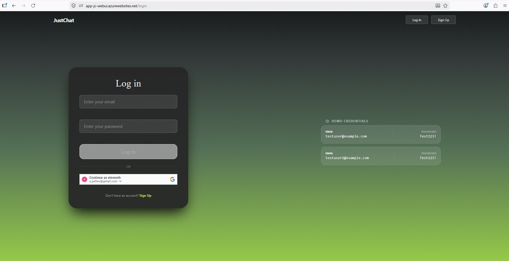
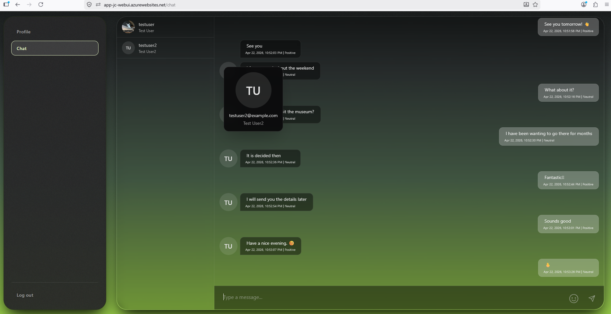
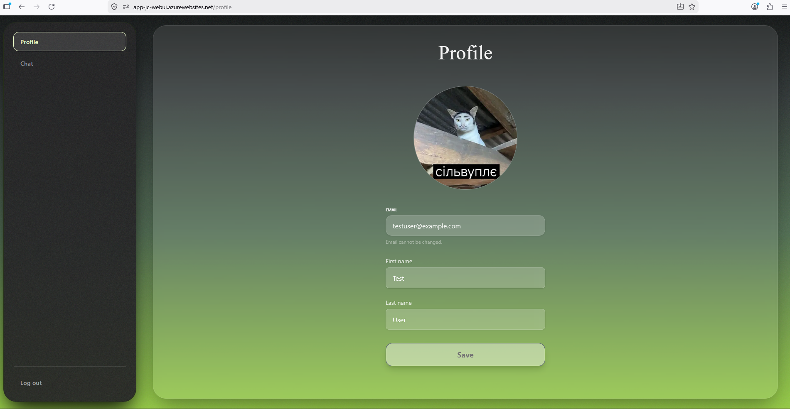

# Just Chat

## Solution Structure

```text
/
├── azure-pipelines.yml          # Azure DevOps: build Angular, publish API/worker, SSDT dacpac, deploy
└── src/
    ├── JustChat.API/            # ASP.NET Core Web API (REST controllers, SignalR hub, filters, exception handling)
    ├── JustChat.WebUI/          # Angular SPA (auth, chat, profile; Tailwind + DaisyUI)
    ├── JustChat.Application/    # use cases, services, validators (FluentValidation), ApiResponse<T>, Result<T> / errors
    ├── JustChat.Domain/         # domain entities, enums, validation constants
    ├── JustChat.Contracts/      # DTOs, requests, shared contracts between API, worker, and UI
    ├── JustChat.Infrastructure/ # DI, EF Core persistence, Identity, Azure integrations (Blob, Service Bus, Text Analytics, SignalR)
    ├── JustChat.DatabaseProject/# SSDT sqlproj (schema), builds to .dacpac
    └── JustChat.Functions/      # Azure Functions worker (Service Bus–triggered email via Azure Communication Email)
```

## About The Project

**Just Chat** is a full-stack chat application with a layered backend (`Application` / `Domain` / `Infrastructure`) and two client-facing surfaces: a **JWT-secured REST + SignalR API** and an **Angular** single-page app. The UI is hosted separately from the API and talks to it over HTTPS with credentialed CORS where needed.

- **API**: Account flows (register, login, Google sign-in, refresh, logout), user profile (read/update, photo upload to Azure Blob Storage), paginated chat history, and a real-time **SignalR** hub for live messages and presence. Outgoing messages are analyzed with **Azure AI Language** for sentiment, which is stored with each message. Registration can enqueue **welcome email** notifications through **Azure Service Bus**, processed by the Functions worker.
- **WebUI**: Angular 19 app with route guards (`GuestGuard` / `AuthGuard`), NgRx Signals stores where appropriate, `@microsoft/signalr` for the chat hub, Google Identity Services for “Continue with Google”, and **Tailwind CSS** + **DaisyUI** for layout and components.

Public demo: [https://app-jc-webui.azurewebsites.net](https://app-jc-webui.azurewebsites.net)

## Features

- **Consistent API responses:** Successful controller payloads are wrapped in an `ApiResponse<T>` envelope (`Success`, `Data`, `Error`) via `ApiResponseEnvelopeFilter`, so clients get a uniform JSON shape.
- **Result-based flow:** Application code uses `Result<T>` with typed `Error` / `ErrorType`; controllers map outcomes with `Match(...)` and `CreateErrorResponse()` instead of relying on exceptions for expected failures.
- **Global exception handling:** `IExceptionHandler` (`GlobalExceptionHandler`) turns unhandled exceptions into structured `ApiResponse<object>` error responses.
- **Cross-cutting API filters:** `FluentValidationActionFilter` runs request validators, and `PaginationNormalizationFilter` clamps `PageNumber` / `PageSize` for `PaginatedRequest` models against configured limits.
- **Auth:** ASP.NET Core **Identity** with an EF Core store, **JWT Bearer** authentication (including explicit `Authorization` header parsing and `access_token` query support for SignalR `/hubs` paths), **httpOnly** refresh-token cookies for rotation, and **Google** token verification for `login-google`.
- **Real-time chat:** `ChatHub` initializes history + online users, broadcasts connect/disconnect, and persists new messages through `IMessageService` (sentiment from `AzureSentimentService` when available).
- **Data access:** **Entity Framework Core** (SQL Server) with repositories, `IdentityUserContext<AppUser>`, interceptors for timestamps, and reusable pagination (`ToPagedAsync`).

The **Azure DevOps** pipeline restores the solution, runs a **production** Angular build (`npm run build`), publishes **JustChat.API** and **JustChat.Functions**, builds **JustChat.DatabaseProject** to a **`.dacpac`**, and deploys to **Azure SQL**, **App Service** (API + Linux Node host for the Angular static site behind **pm2**), and **Azure Functions** for the email worker.

---

## Used Technologies

- **.NET** — `JustChat.API` targets **.NET 10**; `JustChat.Functions` targets **.NET 8** (Functions v4 isolated worker).
- **ASP.NET Core** — Web API, SignalR, authentication middleware, CORS, Serilog.
- **FluentValidation** — Request validators registered from `JustChat.Application`.
- **Authentication / authorization** — JWT Bearer, ASP.NET Core Identity (EF store), Google ID token flow for the SPA.
- **Data & storage** — Entity Framework Core (SQL Server), Azure Blob Storage (profile photos), SSDT **dacpac** deployments.
- **Azure** — Azure DevOps Pipelines, App Service (API + SPA), Azure Functions, Azure SQL, Azure SignalR Service, Azure Service Bus, Azure Key Vault (`DefaultAzureCredential`), Azure AI Text Analytics (sentiment), Azure Communication Email (worker).
- **Frontend** — Angular 19, RxJS, NgRx Signals (`@ngrx/signals`), ngx-toastr, Tailwind CSS v4, DaisyUI, cropperjs (profile image).

---

## User Instructions

### 1. Open the application

Go to **[https://app-jc-webui.azurewebsites.net](https://app-jc-webui.azurewebsites.net)**.

### 2. Wait for the first load (Azure cold start)

The app and API run on **consumption / free-tier–style** Azure resources. After a period of idle time, the **first request** can take **up to about a minute** while services wake up. If the page or API seems slow right after you open the link, wait briefly and refresh once.

**System note** (cold start banner shown in the hosted UI):



### 3. Welcome screen and account choice

The landing page invites you to **Start talking** (registration) or **I already have an account** (sign-in). New users should complete **Register**; returning users use **Login**.



### 4. Register

Create an account with email, password, and profile names. After a successful registration you are signed in and routed into the main app.



### 5. Sign in (email/password or Google)

Use **Sign in** with your credentials, or **Continue with Google**. For quick demos you can use the in-app **demo credential** rows (when enabled in the environment), for example:

- `testuser` / `Test123!`
- `testuser2` / `Test123!`



### 6. Chat

Open **Chat** from the shell. Messages appear in real time via **SignalR**; you can see **sentiment** on messages (when the Text Analytics integration is available) and who is **online**. Older messages load in pages when you scroll up.



### 7. Profile

Under **Profile**, update **personal information** and manage your **profile photo** (upload, crop, delete). Photos are served from blob storage after upload.


